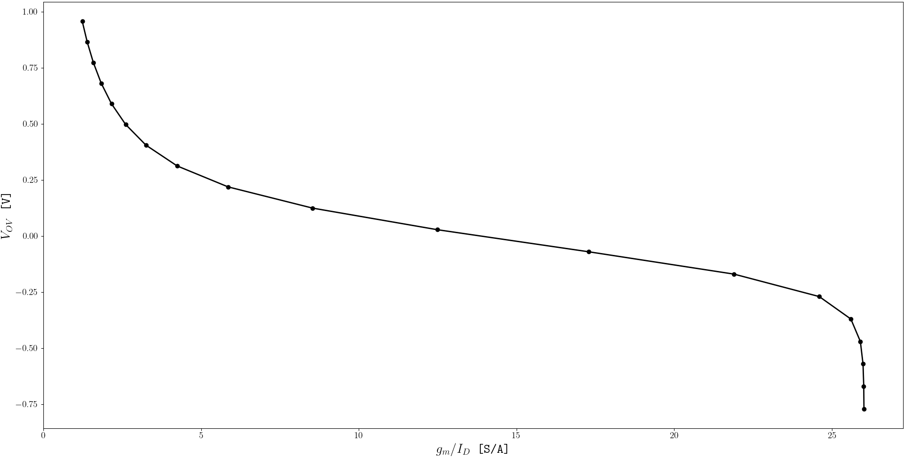
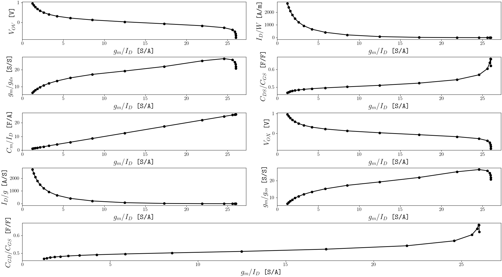
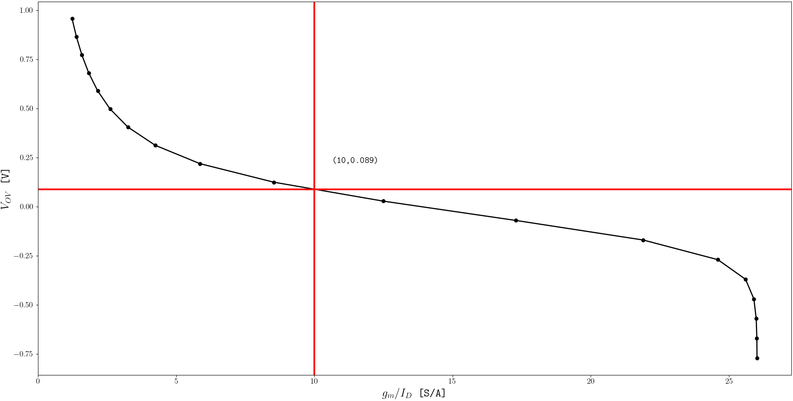
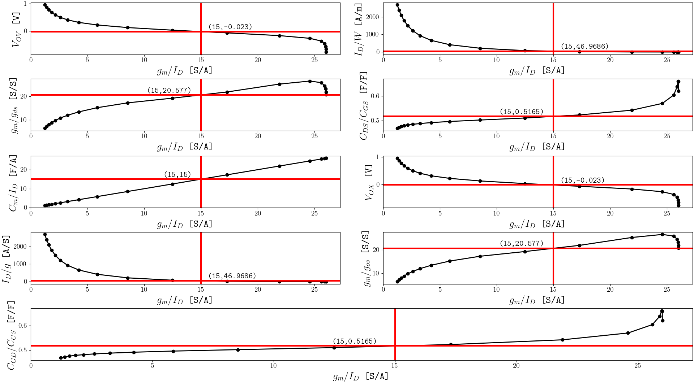

# GMID-Designer

A tool intended for determining sizings for intial designs for analog SSI utilizing $g_m/I_D$ design methodology.

## What is $g_m/I_D$ Design Methodology?

$g_m/I_D$ Design Methodology is a technique often used by designers to get an idea of how to size transistors for thier applications.

This technique involves selecting a known value of $g_m/I_D$ and evaluating it across various different design parameters that depend on this ratio.
These dependencies can be derived analytically or extracted from simulation data. A common parameter that has a dependence is
the **current density ($I_D/W$)**. Since designers often have a target **drain current ($I_D$)** in mind, they can use this relationship to work backwards
and determine the actual transistor width.

While powerful, this approach involves working with a large amounts of data and plots, thus making manual iterations through plots and interpolations quite tedious and laborious.
This is where **GMID-Designer** comes in: it streamlines the process by letting you visualize and explore all relevant data in one place. 

For more about the methodology itself, check out this neat article: [A Basic Introduction to the gm-id Based Design Methodology](https://picture.iczhiku.com/resource/eetop/SHITwppaOwepYMBX.pdf) 

## Installation

*Disclaimer:* Currently, only a prototyped python version of the tool is deployed and working. A more performant version in `C++` will be made in the near future.

TO DO: Provide installation instructions

```text
export GMID_INSTALL_PATH=<path-to-python>
export GMID_DATA_PATH=<path-to-your-data>/example_data.csv
export GMID_CONFIG_PATH=<path-to-your-config>/example_config.json
export GMID_OUTPUT_PATH=<path-to-place-your-output>
export GMID_PATHS=$GMID_INSTALL_PATH:$GMID_DATA_PATH:$GMID_CONFIG_PATH:$GMID_OUTPUT_PATH
```

After paths are established, you can verify that the tool is using them by running the following commands:
```text
gmid view
```

## Getting Started

### Preparing your Data for GMID-Designer

Before one can fully utilize the tool, we need to make sure that the header line of your data formatted in a certain way:

```text
vov gmoverid jd ... cdsovercgs variable_you_want_to_capture
```

Remember you need to set the `GMID_DATA_PATH` to point to your data. Also, note that the way the headers are formatted will be the way they are formatted on the plots.

> NOTE: All data used for this section is from `./python/sample_data/nmos.csv` which is current efficiency data obatined from the open source SKY130 PDK.

### Setting the Design Header

By default, the design header is `gmid`. You can establish the value to be visualized by running the following command:

```text
gmid set 10
```

You can also set the design header to be any other header provided in your data. Use the following as an example:

```text
gmid set 10 -h vov
gmid set 10 --head vov
```

### Interpolation

Often you might just want an idea of what the values are at that $g_m/I_D$ values. You can do so running the following command
after you have already `set` the header:

```text
gmid interp vov
```

The output should look like:

```text
For 'gmid' = 10.0:
  'vov' = 1.232
```

Note that you cannot interpolate the set value with the set header:

```text
gmid interp cdsovercgs   # Valid Syntax
gmid interp gmid         # Invalid Syntax!
```

TO DO: Explain batch mode

### Plotting

To view a plot of the set header with respect to another header you can execute the following command:

```text
gmid plot vov
```

If you are using the default configuration for the tool, your output should look like:



You can also view a plot that is with respect to all of the other headers by using `all`., running the following command should produce the following figure.
`all` is an internal header that is only used by the tool and should not be set in header line of your data. 

```text
gmid plot all
```
If you are using the default configuration for the tool, your output should look like:



#### Plot Annotations

You can also add annotations to your plots by doing the following:
```text
gmid plot vov --annotated
```
If you are using the default configuration for the tool, your output should look like:



The annotation feature also works with plots against `all`:



#### Versus Plotting

TO DO: Talk about `VSPLOT` command.

